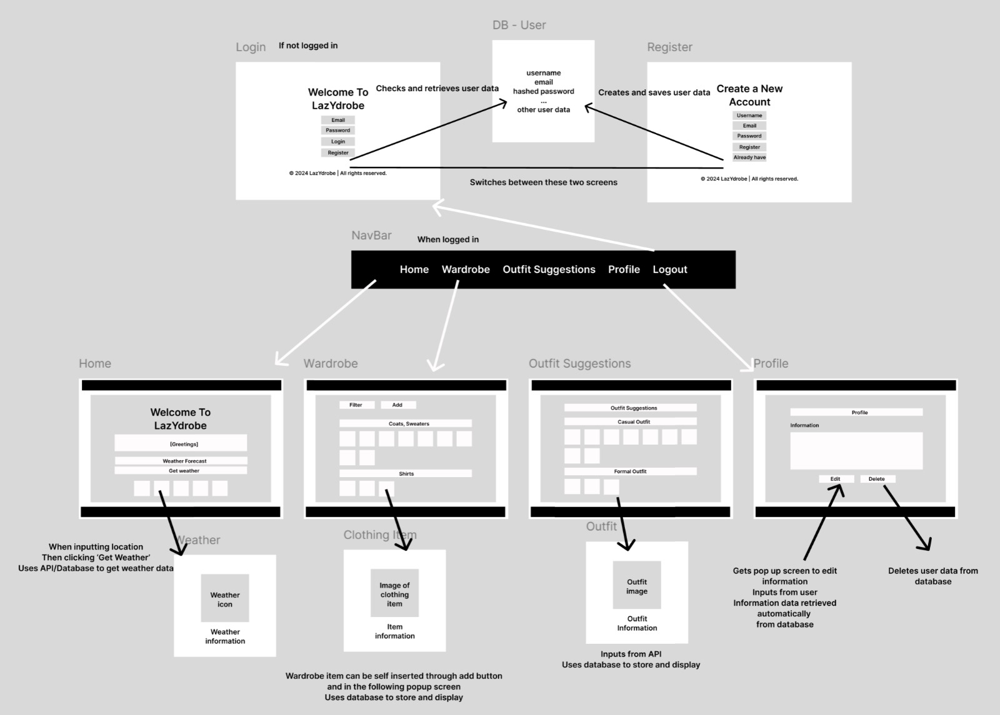

# Frontend Guide - LazyDrobe
This guide provides instructions on how to set up, run, and understand the front-end code for the LazyDrobe wardrobe management app. This initial version covers setting up a basic prototype with core components, layout styling, and mock data.

## Objective
The current goal is to develop the front-end architecture of LazyDrobe. This prototype includes major components and layout styling, using mock data to simulate an API. These components are designed to be flexible and scalable, preparing for future API integration.

## Wireframe



## Prerequisites
Before running this code, ensure you have the following installed:

Node.js (version 14.x or higher)
npm (included with Node.js) or yarn

## Getting Started
Follow these steps to set up and run the front-end code on your local machine.

### 1. Clone the Repository
Clone the repository to your local machine:

```
git clone https://github.com/username/lazydrobe.git
```
Note: Replace username with your GitHub username if you forked the repository.

### 2. Navigate into the Project Directory
Change to the project’s directory:
```
cd lazydrobe
```
### 3. Install Dependencies
Install the necessary packages using npm or yarn:


#### Using npm
```
npm install
```

#### OR using yarn
```
yarn install
```
This will install all required packages, including react, react-router-dom, and react-modal.

### 4. Create a .env file in the project root directory
Add the following fields:
- REACT_APP_VISUAL_CROSSING_API_KEY
- REACT_APP_OpenAI_API_Key
- REACT_APP_ebay_API_KEY
- REACT_APP_DATABASE_URL

### 5. Start the Application
Start the development server:

#### Using npm
```
npm start
```

#### OR using yarn
```
yarn start
```
After starting, the app should open automatically in your browser at http://localhost:3000. If it doesn’t, open the link manually.

## Project Structure
Here's an overview of the project directory structure:

```
lazydrobe/
├── public/
│   └── index.html               # Main HTML file for the React app
├── src/
│   ├── styling/                 # All React components' CSS files
│   ├── components/              # All React components
│   │   ├── Login.js             # Login page component
│   │   ├── Home.js              # Home page component
│   │   ├── Navbar.js            # Navigation bar component
│   │   ├── Footer.js            # Footer component
│   │   ├── Wardrobe.js          # Main wardrobe screen
│   │   ├── WardrobeItem.js      # Individual wardrobe item component
│   │   ├── WardrobeModal.js     # Modal component for adding/editing wardrobe items
│   │   ├── ECommerce.js         # Main shopping screen
│   │   ├── ECommerceItem.js     # Individual ecommerce item component
│   │   ├── ECommerceModal.js    # Modal component for adding/editing ecommerce items
│   │   ├── OutfitSuggestions.js # Outfit suggestion screen
│   │   ├── FiveDayWeather.jsx   # Weather component
│   ├── App.js                   # Main app component with routes
│   ├── index.js                 # Entry point to render the app
│   └── App.css                  # Unified styling for all components
├── .gitignore                   # Excludes unnecessary files from Git
├── README.md                    # General project overview and instructions
├── package.json                 # Lists dependencies and scripts
├── package-lock.json            # Locks dependencies to specific versions
```
## Key Components
The following core components were identified in the wireframe and are implemented in this prototype:

 - Login (Login.js): Displays the login screen for the app.  
 - Home (Home.js): Displays the home screen for the app.  
 - Navbar (Navbar.js): Displays the navigation links for the app.  
 - Footer (Footer.js): Shows copyright information.  
 - Wardrobe (Wardrobe.js): Displays wardrobe items with filtering functionality.  
 - WardrobeItem (WardrobeItem.js): Represents individual wardrobe items.  
 - WardrobeModal (WardrobeModal.js): Modal for adding/editing wardrobe items.
 - ECommerce (ECommerce.js): Displays ecommerce items with filtering functionality.  
 - ECommerceItem (ECommerceItem.js): Represents individual ecommerce items.  
 - ECommerceModal (ECommerceModal.js): Modal for adding/editing ecommerce items. 
 - OutfitSuggestions (OutfitSuggestions.js): Displays outfit recommendations based on weather.  
 - OutfitSuggestions (OutfitSuggestions.js): Displays outfit recommendations based on weather.  

These components are designed based on our wireframe's hierarchy and interaction flows.  

## Styling
All component styles have their own css files, located in the src/components/styling folder. The styling is focused on layout rather than aesthetics, using a clean and minimal design to emphasize functionality over appearance.

## Mock Data
To simulate future API integration, we have implemented mock data. This mock data structure will mirror the real data from the backend API, which will eventually be implemented with FastAPI.

Example of Mock Data (located within each component for now):


const mockItems = [
  { id: 1, name: "T-Shirt", category: "Tops", image: "link_to_image" },
  { id: 2, name: "Jeans", category: "Bottoms", image: "link_to_image" }
];
The mockItems array in each component is currently used to display data in the wardrobe and outfit suggestions screens.

## Available Scripts
In the project directory, you can run:

npm start: Runs the app in development mode.
npm run build: Builds the app for production to the build folder.
npm test: Launches the test runner.

## Documentation and Development Process
Project Description: LazyDrobe is a wardrobe management app designed to help users organize clothing, receive outfit suggestions, and shop for recommended items.

Component Breakdown: Each component is kept separate to maintain a clear hierarchy and separation of concerns. Components are kept simple to allow for rapid iteration and easy integration with the backend API in the next phase.

Design Decisions: Based on our wireframe, we have broken down the interface into discrete, reusable components (e.g., Navbar, Footer, WardrobeItem) to ensure a scalable structure. Styling has been kept minimal to focus on functionality and layout.

Technical Choices:

React: Selected for its component-based structure, which aligns with our wireframe and layout needs.
react-router-dom: Chosen for client-side routing between different sections of the app.
react-modal: Used to create modal dialogs for adding or editing wardrobe items.
AI Usage: AI was used to assist with file organization, 2-3 javascript file code glitches, format and ensure best practices were followed in component breakdown and mock data handling.

## Troubleshooting
Dependency Issues: If you encounter issues during npm install, ensure you have the latest version of Node.js and npm installed.
Development Server: If the app doesn’t load in the browser, confirm that the development server is running on http://localhost:3000 and that no other app is using this port.
